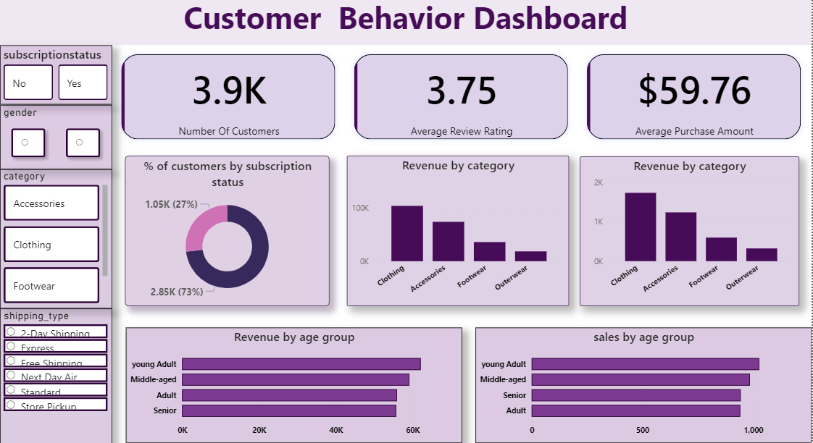

# 🛍️ Consumer Behavior Analysis

An end-to-end Data Analytics project that analyzes customer shopping behavior using **Python**, **SQL Server**, and **Power BI**. The objective is to uncover purchasing trends, customer preferences, and business insights that can help improve marketing strategies, customer engagement, and overall sales performance.

---

## 📌 Business Problem

A retail company wants to better understand customer shopping behavior to improve sales, customer satisfaction, and customer loyalty. This project analyzes demographic information, purchasing patterns, product categories, reviews, payment methods, subscriptions, and seasonal trends to support data-driven decision making.

---

## 🎯 Objectives

- Clean and preprocess customer shopping data using Python.
- Store and analyze the dataset using SQL Server.
- Create an interactive Power BI dashboard.
- Generate business insights and recommendations.

---

## 🛠️ Tech Stack

- Python
- Pandas
- NumPy
- SQL Server (SSMS)
- Power BI
- Git & GitHub

---

## 📂 Project Structure

```
consumer-behavior-analysis
│
├── data
├── notebooks
├── sql
├── powerbi
├── reports
├── screenshots
└── README.md
```

---

## 🔄 Project Workflow

```
Raw Dataset
      │
      ▼
Python Data Cleaning
      │
      ▼
SQL Server Analysis
      │
      ▼
Power BI Dashboard
      │
      ▼
Business Insights
```

---

## 📊 Dashboard Preview



---

## 📈 Dashboard Highlights

- Total Customers: **3.9K**
- Average Review Rating: **3.75**
- Average Purchase Amount: **$59.76**
- Revenue Analysis by Category
- Revenue by Age Group
- Sales by Age Group
- Subscription Analysis
- Interactive Filters for Gender, Category and Shipping Type

---

## 🔍 Key Insights

- Clothing generated the highest revenue among all product categories.
- Young Adults contributed the highest overall revenue.
- Approximately 73% of customers were non-subscribers.
- Customer spending varied across different age groups.
- Review ratings averaged around **3.75**, indicating moderate customer satisfaction.

---

## 💡 Business Recommendations

- Increase promotional campaigns for high-performing product categories.
- Improve subscription benefits to increase customer retention.
- Create targeted marketing campaigns based on customer age groups.
- Use customer reviews and seasonal trends to improve product strategy.

---

## 🚀 Future Improvements

- Build predictive models for customer purchase behavior.
- Develop customer segmentation using Machine Learning.
- Deploy the dashboard online using Power BI Service.
- Automate the data pipeline.

---

## 👨‍💻 Author

**Piyush Sanjay Udapurkar**

- GitHub: https://github.com/piyush-0301
- LinkedIn: https://www.linkedin.com/in/piyush-udapurkar-7484a1295

---

⭐ If you found this project interesting, consider giving it a star!
